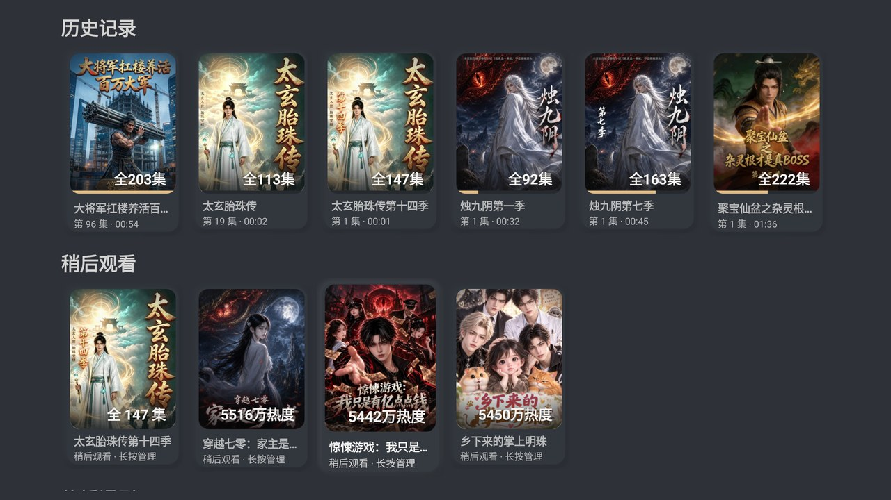
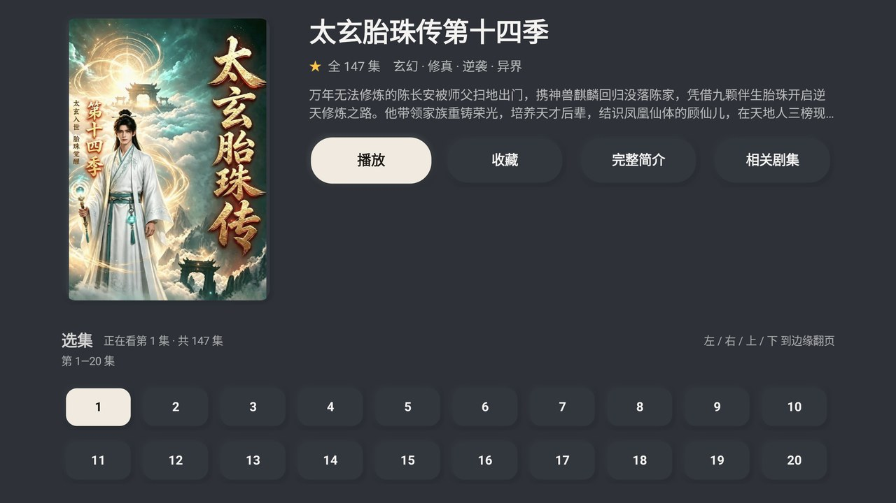
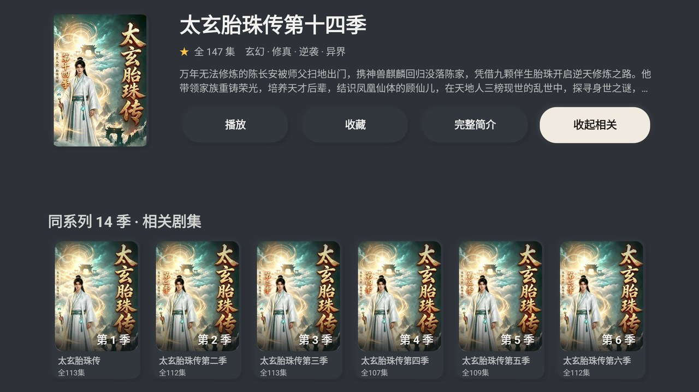
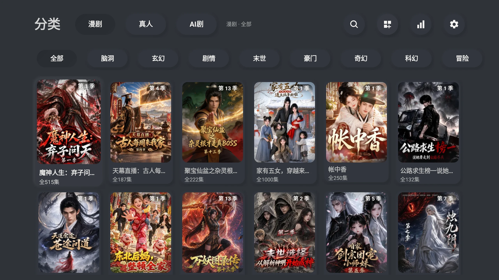
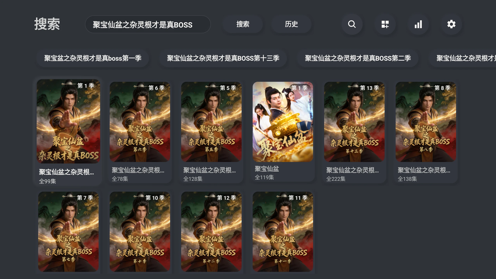
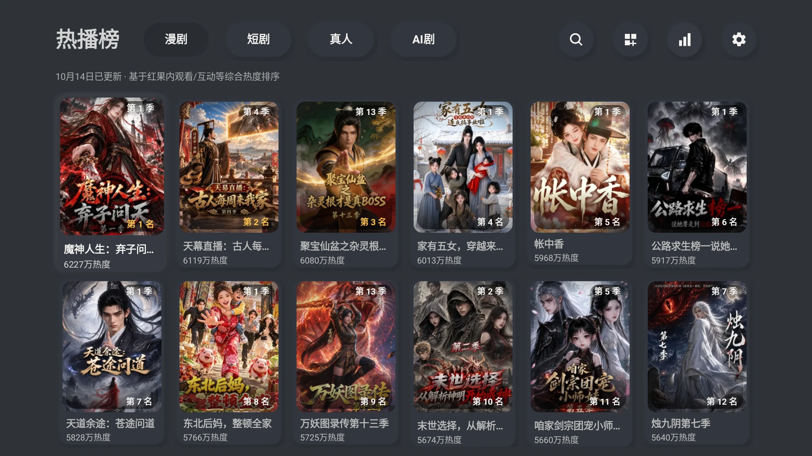
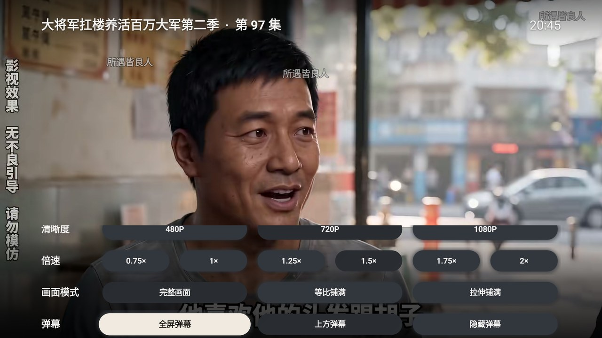
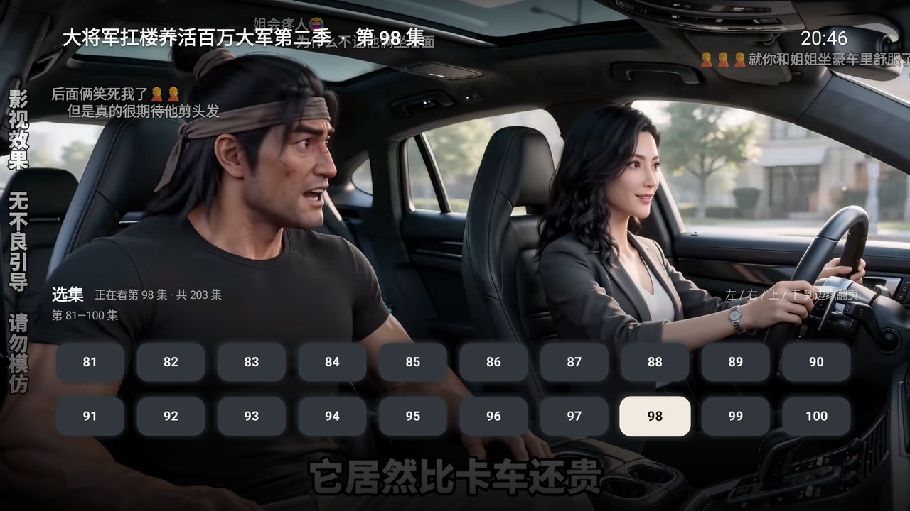

<p align="center"></p>

<p align="center">
  <a href="https://github.com/pan8664716/HGTV/releases/latest"></a>
  <a href="https://github.com/pan8664716/HGTV/releases"></a>
  <a href="https://t.me/hgtvhub"></a>
  <br>
  <br>
  <a href="android/app/build.gradle.kts"></a>
  <a href="android/feature-tv"></a>
  <a href="android/feature-phone"></a>
 </p>

# HGTV（Android TV / 手机 / 平板，4.4+）

短剧客户端：单 APK、Kotlin + ExoPlayer，电视用遥控器、手机平板用触屏，装好联网即可看；不登录也能浏览播放，登录可同步云端收藏、历史与预约，同一局域网还可迁移完整本机数据。

## 目录

- [功能](#功能)
- [界面](#界面)
- [下载](#下载)
- [当前限制](#当前限制)
- [工程结构](#工程结构)
- [统一参数配置](#统一参数配置)
- [开发](#开发)
- [维护者](#维护者)
- [参与贡献](#参与贡献)
- [交流](#交流)

## 功能

- **浏览**：首页分区剧架、八类榜单（横滑导航，前三名金银铜角标）、分类页（大类 / 小类）；电视首页默认显示推荐、热播、新剧三榜；分类面板与已选列表会缓存，切换大类或筛选时不再重复加载；海报卡左下角带热度角标（没有热度就不显示），列表右下角有「回到顶部」（可设为始终显示 / 下拉几行后显示 / 不显示，首页不显示）。
- **推荐**：打开应用可直接进推荐页，上下换剧、左右快进、按确定看正片；推荐流分批补页，快速下滑不断档；进度条与正式播放一致，可拖动并显示缓存进度；推荐范围与男频 / 女频可在设置调整，电视还可只推荐横屏短剧，隐藏过的剧集可一键恢复。
- **搜索**：电视默认 HG 键盘；历史搜索在前、推荐词在后，每页 100 条；搜索源可切 App / 官网，也可扫码用手机输入。
- **收藏与记录**：本机收藏、最近观看、稍后看，支持断点续播与「继续观看」直达；历史可按已看完 / 未看完筛选、可一键清空；手机与平板的「我的」页栏目可横向滑动，并支持当页批量勾选删除；卡片长按或按菜单键可收藏 / 稍后看 / 隐藏推荐 / 删除记录。
- **登录**：「我的」页扫码或手机号 + 验证码两种登录，二维码过期自动刷新，登录后可退出或刷新；进入我的页先看第三方客户端使用须知，取验证码前每次确认。
- **设备同步**：同一局域网内可选择「同步其他设备」或「作为同步源」，自行勾选登录信息、设备参数、播放收藏记录和设置信息；记录合并并保留进度更高的一条。
- **重装恢复**：卸载重装后自动恢复登录与设备身份，不用重新注册、重新收验证码。
- **预约**：显示上线时间，可按已上线 / 待上线筛选；详情页列出相关剧集。
- **选集**：详情页与播放器内同一套选集网格，每页 10–50 集可选、按页翻看；边缘翻页可关，关掉后左右边缘改为选上一集 / 下一集。
- **播放**：360P / 480P / 540P / 720P / 1080P 上限、0.50–3.00× 倍速（0.05× 步进）、三种画面模式、画面缩放 1–100%、自动连播，最后一集有下一季时自动进入下一季；播放域名由 TNC 动态选择，取流失败会切换候选域名与备用地址并自动重试；手机与平板播放页提供相关剧集、作者作品与加入收藏，并兼容 Android 4.4–9；推荐与播放页会批量预取后续剧集，快速跳集更稳；起播复用本机缓存，再次打开更快；左右滑动调进度，进度条可拖动并显示缓存进度，画面上可常显剧名 / 剧集 / 网速 / 时间，电视顶部信息更靠上，手机竖屏与体裁栏对齐；手机横竖屏切换与换集时黑边保持纯黑，弹幕仍显示在画面上层；手动换集首帧按本集比例显示，不拉伸；播放设置、选集面板与底部控制条可设 2–15 秒无操作自动收起（暂停、拖进度同样计时），手机平板的推荐页也一样；正式播放的上下换集与推荐页左右翻页使用统一的跟手吸附动画。
- **视频解码**：硬件解码（默认，省电、4K 更稳）与软件解码（兼容性好，花屏 / 绿屏 / 音画不同步时用）可切换。
- **按键自定义**：播放界面的上下左右 / 菜单 / 确定键各做什么可改，支持一键恢复默认。
- **弹幕**：切集和进入下一季时保留上一集弹幕并无缝衔接；默认上方显示，也可切换只显一行 / 全屏 / 隐藏，表情标签还原成表情图；电视可避开顶部播放信息，手机推荐播放页与正式播放页首行对齐；速度、字号与透明度可调；相同弹幕可聚合（2–10 条起聚，持续出现累计计数，停发 20 秒后重计），聚合弹幕展示 7 秒、每次 +1 重新计时，按显示方式最多同屏 1 / 2 / 3 条；可开启或关闭聚合特效，特效包含计数放大、渐热颜色与高计数冲击效果。
- **定时停止**：按分钟或按集数到点暂停并保存进度。
- **播完推荐**：一集播完自动接下一集；最后一集有下一季时自动进入下一季，否则推荐下一部。
- **手机辅助**：扫码在手机上输入搜索词、备份与恢复本机记录；局域网全量同步可在手机、平板和电视之间迁移登录、设备、记录与设置。
- **界面**：启动时显示品牌 Logo 与加载状态，初始化失败可直接重试；新安装先选择手机 / 平板 / 电视，再按所选类型使用触屏或遥控器确认，不再自动判定；20 套材质主题、手机竖屏每行 1–3 张 / 横屏 4–6 张、电视每行 4–8 张、功能显示开关（导航入口 / 首页栏目 / 播放信息各自可关）、减少动画优化性能、竖屏短剧全屏（仅手机、平板可用）；手机与平板可点按操作，横屏主页、详情、登录、设置与选集完整适配，平板点画面出控制条，界面字号与每行卡片数可调（首次进入会提示）；手机底部导航避开系统导航区并采用透明背景，推荐页竖屏操作条不与导航重合；手机双击返回退出，电视按两次返回退出。
- **设置**：四大项分页（播放偏好 / 内容与来源 / 按键与弹幕 / 系统高级），偏好自动保存；手机和电视均可在手机 / 平板 / 电视三档之间切换设备类型，不再提供自动档；播放设置与系统设置提供调试模式开关；选集分页、边缘翻页、播放界面自动消失秒数、弹幕聚合条数、返回顶部显示时机均可调；可查看开源许可、清空应用缓存（恢复出厂）。
- **语言**：界面文案支持简体中文与台湾 / 香港 / 澳门繁体中文，跟随系统地区自动选择。
- **更新**：内置 GitHub 镜像更新地址，无需也不能自行设置；TV 设置「设备与性能」和手机设置「系统高级」提供检查更新入口，手机「我的」右上角设置按钮也会显示更新红点。发现新版后 TV 顶栏才显示圆钮和红点，不主动弹窗，下载校验后交给系统安装器。
- **正版检测**：前台累计运行 30 分钟后校验包名与签名，异常时提示前往官方 Releases 下载。

## 界面

新拟态（Neumorphism）风格：全站只有一块材质，层次由「凸起 / 凹陷」与柔光表达；
播放界面不套新拟态，压在画面上的字与线固定暖白，避免和画面抢注意力。20 套材质主题（十套深色、十套浅色，默认深海蓝）如下：

交互原型（1280×720，含 20 套主题与各页面焦点态）：[`docs/prototype/index.html`](docs/prototype/index.html)。

<table>
<tr>
<td align="center"></td>
<td align="center"></td>
<td align="center"></td>
</tr>
<tr>
<td align="center"></td>
<td align="center"></td>
<td align="center"></td>
</tr>
<tr>
<td align="center"></td>
<td align="center"></td>
<td align="center"></td>
</tr>
</table>

## 下载

从 [Releases](https://github.com/pan8664716/HGTV/releases/latest) 下载最新正式 APK，拷到设备安装，或用 ADB 覆盖安装：

```sh
adb install -r HGTV_1.3.8.11.apk    # 文件名：<标识>_<版本号>.apk
```

应用内更新入口不主动弹窗；也可以在 Releases 手动下载覆盖安装（本机收藏、进度与设置保留）。
当前版本 `1.3.8.11`（versionCode 95），各版本改动见[变更记录](docs/CHANGELOG.md)。
应用内更新检查与安装包下载均走 gh 镜像；手动下载也可用[镜像地址](https://gh-proxy.org/https://github.com/pan8664716/HGTV/releases/latest)。
GitHub Release 只提供 APK、校验文件和更新元数据，不附带项目源码。

应用与内容平台官方无关联，内容接口为非官方实现，平台变化可能导致失效；
当前已知的限制见 [当前限制](#当前限制)。

### 依赖

- Android TV、手机或平板，Android 4.4（API 19）及以上；设备形态可在设置里手动指定。
- APK 集成友盟统计与 APM，原生库仅保留 ARM 32/64 位；视频解码能力取决于设备，
  遇到花屏、绿屏或音画不同步可在设置里改用软件解码。
- 换用别的签名重建后不能覆盖安装本仓库发布密钥签名的 APK（卸载会清除本机记录）。

## 当前限制

平台是非官方接口，随版本变化随时可能失效。当前已知的限制：

### 播放

- 拉流地址是 CDN 直链，**有时效**；清晰度上限 1080P，个别编码的流会被跳过
  （部分设备只有声音没画面）。
- 偶发拿不到地址时会先用备用设备重试，仍失败再重新注册设备；仍然失败时界面给出可重试的说明，稍后再试即可。

### 其他

| 现象 | 说明 |
| --- | --- |
| 搜索没结果 | 接口偶发空响应，会自动重发；仍为空时下次启动会重新注册设备 |
| 电视和手机弹幕数量不同 | 平台按设备身份和采样返回，电视与手机可能不同；客户端按实际下发显示 |
| 应用内更新失败 | 可到 Releases 手动下载覆盖安装 |
| 电视上「竖屏短剧全屏」是灰的 | 这一项只在手机 / 平板上可用；电视的画面本来就按等比铺满摆放，不需要再旋转 |

平台接口随版本变化，个别功能可能短期不可用；界面上会给出可重试的说明。

## 工程结构

```
android/                Gradle 工程根（Android Studio 直接打开这一层）
├─ app/                 Application、启动路由、Manifest、图标与签名
├─ core/                网络协议、签名、解析、播放状态机（纯 JVM，可在 JVM 上跑单测）
│  └─ src/test/         单元测试与固定向量
├─ shared/              账号 / 会话 / 收藏 / 进度 / 封面 / 播放传输 / 弹幕渲染 / 调试面板
├─ feature-tv/          电视界面：遥控器 + 焦点导航 + 1280×720 设计画布
├─ feature-phone/       手机平板界面：触摸 + 竖屏 + 手势播放
├─ gradle/ gradlew      Gradle 8.14.3 包装器
└─ build.gradle.kts     构建脚本与发布签名配置
docs/                   项目文档；preview/ 放应用图标与界面截图
tools/                  工程脚本；目录清单与本机资料约定见 tools/README.md
README.md
```

依赖方向单向，不允许反向或横向依赖：`:core` ← `:shared` ← `:feature-tv` / `:feature-phone` ← `:app`。

## 统一参数配置

可调的应用级参数集中放在平台配置入口，页面与业务模块只引用，不再重复写数值：

- Android：[`android/core/src/main/kotlin/com/hgtv/star/core/AppConfig.kt`](android/core/src/main/kotlin/com/hgtv/star/core/AppConfig.kt)

配置按网络、启动、目录、内容仓库、账号、推荐、播放、封面、局域网、缓存、书库、弹幕、
诊断和 UI 分组。UI 内继续区分页面结构（`Navigation / Settings`）与手机 / 电视几何尺寸
（`Ui.Phone / Ui.Tv`）。协议字段、设备身份、状态机枚举与页面专属主题色仍留在各自模块；
已有公开常量保留为兼容别名，但数值来源只认 `AppConfig`。

## 开发

需要 JDK 17、Android SDK Platform 36（Build Tools 35.0.0 及以上）；Gradle 8.14.3 包装器已随仓库提供。
设置 `ANDROID_HOME`，或在 `android/local.properties` 写入 `sdk.dir=<SDK 绝对路径>`。

```sh
# 开发包：直接可安装，无需发布私钥
./android/gradlew -p android :core:test :app:lintDebug :app:assembleDebug
adb install -r android/app/build/outputs/apk/debug/app-debug.apk
```

静态校验与离线校对图（校对图输出到 `docs/preview/.local/`，不入库）：

```sh
python3 tools/verify-button-system.py    # 按钮系统规则（全站唯一实现、三档尺寸、令牌化内边距）
python3 tools/app-icon.py --check        # 矢量 / 位图 / 背景色与脚本是否同源
python3 tools/app-icon.py                # 重出应用图标、电视横幅与 docs/preview/app-logo.png
python3 tools/theme-preview.py           # 20 套主题对比度自检 → docs/preview/theme.png
python3 tools/neumorphism-preview.py     # 首页 / 按钮六态 / 强调色校对（仅本机查看）
python3 tools/maintainer-avatars.py --check  # 维护者头像是否为 256px 圆形透明底
tools/version.sh                            # 应用名 / 标识 / 版本号 / 版本 code / 产物名
```

## 维护者
<table>
<tr>
<td align="center"><a href="https://github.com/pan8664716"><br><sub><b>pan8664716</b></sub></a></td>
</tr>
</table>

## 参与贡献
提问或报 bug 请开 [Issue](https://github.com/pan8664716/HGTV/issues)；提交代码前请先开 Issue 说明意图。

## 交流

Telegram 交流反馈：[hgtvhub](https://t.me/hgtvhub)。能复现的问题仍建议开 Issue，方便留档与检索。
